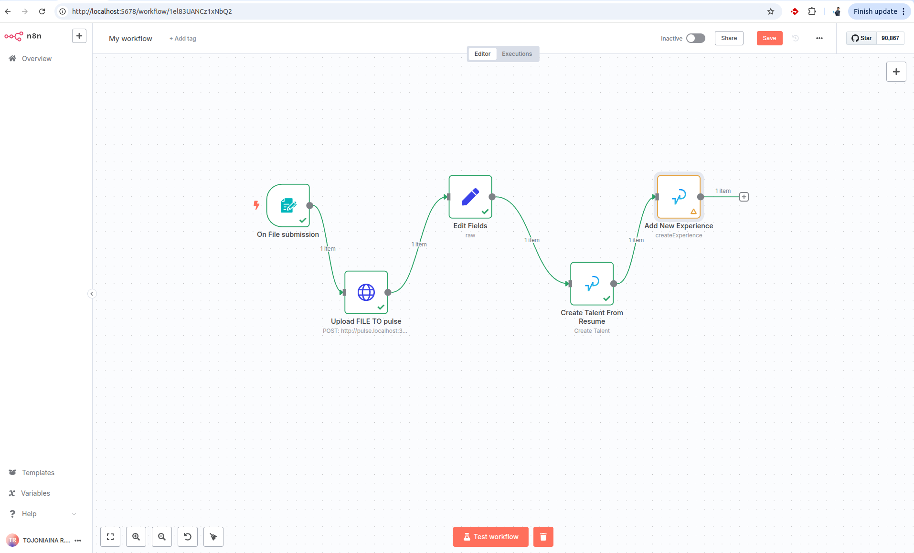
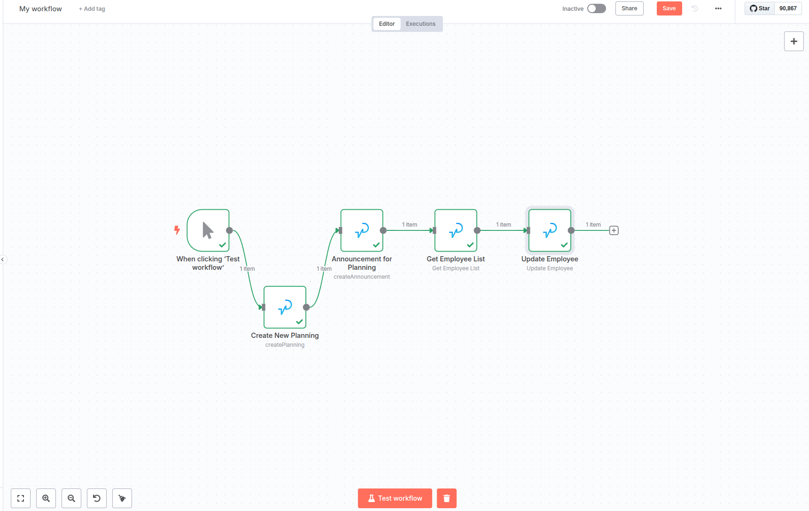
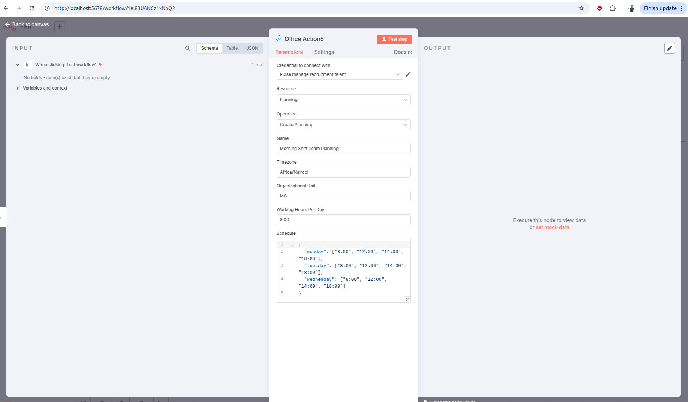
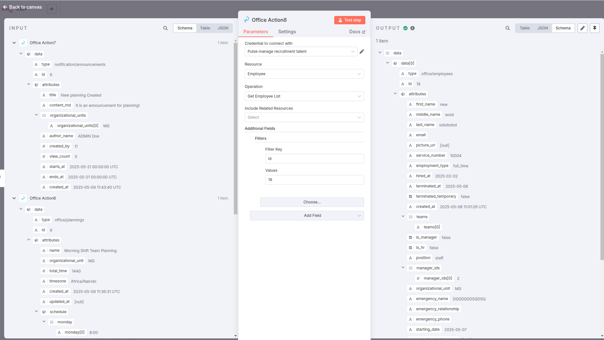
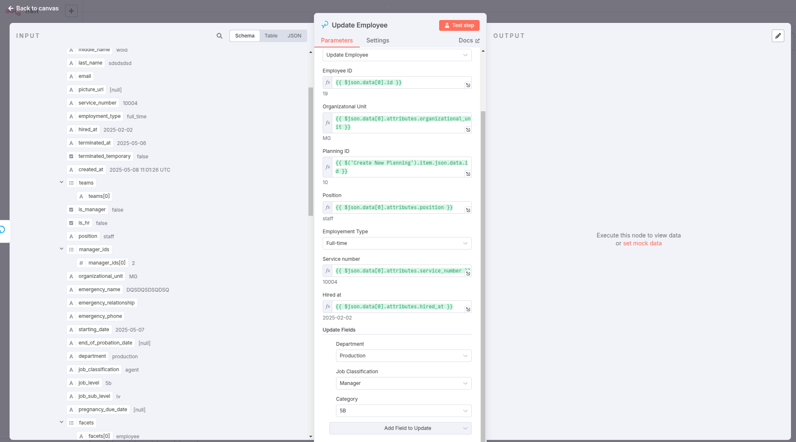
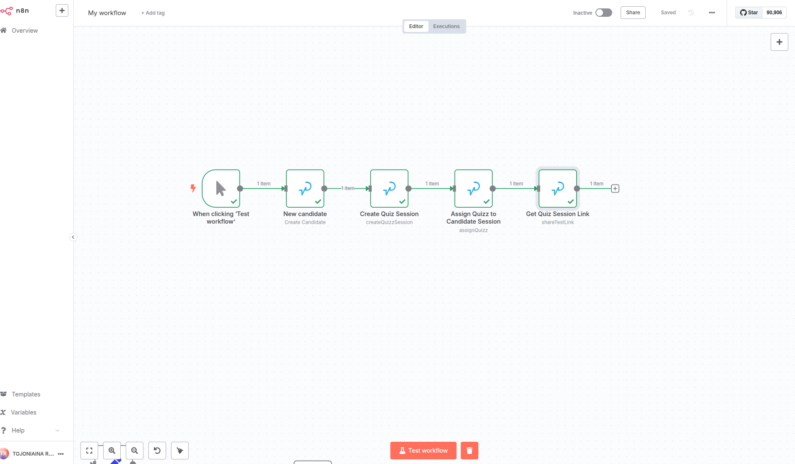
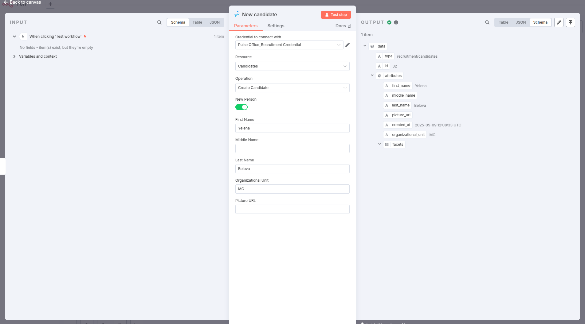
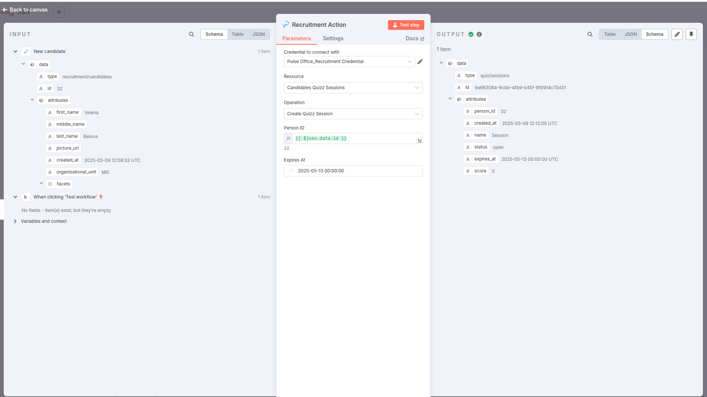

# n8n-ingedata-pulse

This package provides n8n nodes for integration with Ingedata's Pulse platform.

<div align="center">
  
</div>

## What is Pulse?


Pulse is an Enterprise Resource Planning (ERP) system developed by Ingedata ([GitHub](https://github.com/ingedata-ph/octave)). It is a comprehensive platform designed to streamline business operations, resource management, and data integration across various departments. Pulse facilitates efficient workflow management, talent acquisition, employee administration, project tracking, and organizational structure management.

As an ERP system, Pulse centralizes data and processes, enabling teams to work more efficiently with integrated workflows and automated business processes.

## Features

This package provides several nodes for interacting with different aspects of the Pulse platform:

### AccountAction Node

- **Account Operations**:
  - Create, update, and retrieve account information
  - Get current user account information
  - Get user account by ID
- **Account Role Operations**:
  - Create, update, and manage account roles

### OfficeAction Node

- **Employee Operations**:
  - Manage employee records and details
- **Planning Operations**:
  - Create, update, delete, and list planning schedules
  - Manage working hours, timezones, and organizational units
- **Announcement Operations**:
  - Create, update, delete, and list company announcements
  - Manage content, publishing dates, and target organizational units
- **Holiday Operations**:
  - Create, update, delete, and list company holidays
  - Set holiday dates for specific organizational units
- **Leave Request Operations**:
  - Create leave requests for employees
  - Manage various leave types, dates, and supporting documentation
  - Download Leave Balance Report

### OrganizationsAction Node

- **Organizations Operations**:
  - Create and update organization records
  - Manage organization settings and status
- **People Directories Operations**:
  - Create, update, delete, and list people directories

### PeopleAction Node

- **People Operations**:
  - Create, update, and manage people records
  - Store personal and professional information
- **Identity Documents Operations**:
  - Manage identity documents for people records

### RecruitmentAction Node

- **Candidate Operations**:
  - Create, update, and list candidate information
- **Quizz Session Operations**:
  - Create, update, cancel, and list quiz sessions for candidates
  - Assign quizzes to candidates and track scores

### TalentAction Node

- **Talent Operations**:
  - Manage talent profiles and information
- **Skill Operations**:
  - Add, update, and manage skills for talent profiles
- **Language Operations**:
  - Track and update language proficiencies
- **Education Operations**:
  - Manage educational background information
- **Certification Operations**:
  - Track professional certifications and qualifications
- **Experience Operations**:
  - Manage work experience records

### WorkflowAction Node

- **Project Operations**:
  - Create, update, and list projects
  - Manage project status
- **Project Member Operations**:
  - Add, update, delete, and list project members
  - Assign roles and responsibilities
- **Project Document Operations**:
  - Create, update, delete, and list project documents
  - Manage document categories and access rights
- **Project Data Operations**:
  - Store and retrieve custom project data
- **Project Work Unit Operations**:
  - Create, list, and cancel project work units
- **Activity Operations**:
  - Assign members to activities

## Installation

Follow the ([installation guide](https://docs.n8n.io/integrations/community-nodes/installation/)) in the n8n community nodes documentation.

```bash
npm install n8n-ingedata-pulse
```

Or if you're using pnpm:

```bash
pnpm add n8n-ingedata-pulse
```

## Setup

1. Add your Pulse API credentials in n8n:

   

   - API Key
   - API Secret
   - API URL (defaults to https://pulse.ingedata.ai)

#### Generate API Key and Secret from Pulse


2. Use the nodes in your workflows

## Development

### Prerequisites

- Node.js (v16 or later)
- pnpm

### Getting Started

1. Clone the repository
2. Install dependencies:
   ```bash
   pnpm install
   ```
3. Build the project:
   ```bash
   pnpm build
   ```

### Development

1. Run local dev, this will watch any changes to your `./src` files
   ```bash
   pnpm dev
   ```
   Optional to watch changes with icons:
   ```bash
   pnpm dev:icons
   ```
2. Run docker compose
   ```bash
   docker compose up
   ```
3. Go to http://localhost:5678

**Note**: You will need to restart docker compose to reload the n8n node as n8n currently has an issue with linking nodes correctly to n8n.

### Testing

Run the tests:

```bash
pnpm test
```

Run tests in watch mode:

```bash
pnpm test:watch
```

## Project Structure

- `src/credentials/` - Contains credential definitions for Pulse API authentication
- `src/nodes/` - Contains all node implementations:
  - `AccountAction/` - Account management nodes
  - `OfficeAction/` - Office, employee, and planning management nodes
  - `OrganizationsAction/` - Organization and directory management nodes
  - `PeopleAction/` - People record management nodes
  - `RecruitmentAction/` - Candidate and quiz management nodes
  - `TalentAction/` - Talent profile management nodes
  - `WorkflowAction/` - Project and workflow management nodes
  - `common/` - Common base classes and utilities for nodes
- `src/utils/api/` - Contains utility classes for API interaction with Pulse platform
- `src/__tests__/` - Contains tests for all components
- `index.ts` - Main entry point that exports the credentials and nodes

## Usage Examples

### Example 1: Creating a Talent Profile with Resume Upload and Add New Experience entry

This workflow demonstrates how to create a new talent profile and upload a resume:


1. Use a trigger node (like Form Submission with file upload)
2. Use an **HTTP Request** node to upload the resume file to pulse, send the file as a Binary data
3. Add an Edit Fields nodes to convert outut from request as a json to get the URL of the resume
4. Add a **TalentAction** node:
   - Set "Talent" as resource
   - Set Operation to "Create"
   - Make Upload Resume as true
   - Add any additional talent information (Organizational Unit)
   - Add the Url from previous node
5. Add a **TalentAction** node with "Experience" resource:
   - Get talent_id from the new created talent
   - Add relevant work experience

### Example 2: Managing Office Planning and Announcements / Update Employee

This workflow shows how to create a new office planning schedule and announce it:


1. Use a trigger node
2. Add an **OfficeAction** node with "Planning" resource:
   - Set Operation to "Create"
   - Configure schedule with working hours
   - Set appropriate timezone and organizational unit
3. Add an **OfficeAction** node with "Announcement" resource:
   - Set Operation to "Create"
   - Create content announcing the new planning schedule
   - Set organizational units to target specific departments
   - Set publishing date
4. Update an existing employee details with the new planning:
   - Add an **OfficeAction** node with "Employee" resource
   - Set Operation to Get Employee List
   - Add Additional Fileld "Filters" with "key: id" and value the employee_id
   - Add an **OfficeAction** node with "Employee" resource and Operation Update
   - Get All the fields that will not change ffrom the previous nodes
   - Add new value for the one you want to update





### Example 3: Setting Up a Recruitment Process

This workflow demonstrates setting up a recruitment process with candidate tracking and quiz assignment:


1. Use a trigger node
2. Add a **RecruitmentAction** node with "Candidates" resource:
   - Set Operation to "Create"
   - Select "New Person" option
   - Fill in candidate personal information
3. Add a **RecruitmentAction** node with "Quizz Sessions" resource:
   - Set Operation to "Create"
   - Connect to the candidate created in previous step
   - Configure session parameters
4. Use the "Assign Quizz" operation to assign a specific quiz to the session




## License

ISC
