# n8n-ingedata-pulse

This package provides n8n nodes for integration with Ingedata's Pulse platform.

<div align="center">
  
</div>

## What is Pulse?

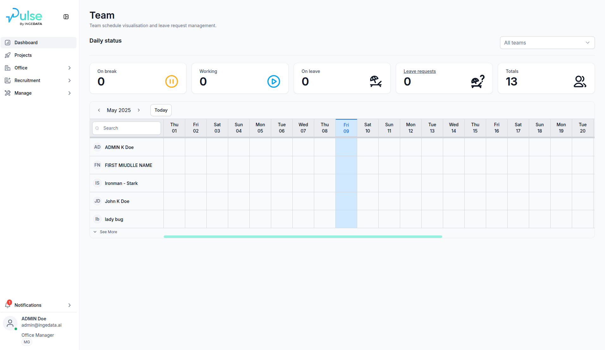

Pulse is an Enterprise Resource Planning (ERP) system developed by Ingedata ([GitHub](https://github.com/ingedata-ph/octave)). It is a comprehensive platform designed to streamline business operations, resource management, and data integration across various departments. Pulse facilitates efficient workflow management, talent acquisition, employee administration, project tracking, and organizational structure management.

As an ERP system, Pulse centralizes data and processes, enabling teams to work more efficiently with integrated workflows and automated business processes.

## Features

This package provides several nodes for interacting with different aspects of the Pulse platform:

### AccountAction Node

- **Account Operations**:
  - Create, update, and retrieve account information
  - Get current user account information
  - Get user account by ID
- **Account Role Operations**:
  - Create, update, and manage account roles

### OfficeAction Node

- **Employee Operations**:
  - Manage employee records and details
- **Planning Operations**:
  - Create, update, delete, and list planning schedules
  - Manage working hours, timezones, and organizational units
- **Announcement Operations**:
  - Create, update, delete, and list company announcements
  - Manage content, publishing dates, and target organizational units
- **Holiday Operations**:
  - Create, update, delete, and list company holidays
  - Set holiday dates for specific organizational units
- **Leave Request Operations**:
  - Create leave requests for employees
  - Manage various leave types, dates, and supporting documentation
  - Download Leave Balance Report

### OrganizationsAction Node

- **Organizations Operations**:
  - Create and update organization records
  - Manage organization settings and status
- **People Directories Operations**:
  - Create, update, delete, and list people directories

### PeopleAction Node

- **People Operations**:
  - Create, update, and manage people records
  - Store personal and professional information
- **Identity Documents Operations**:
  - Manage identity documents for people records

### RecruitmentAction Node

- **Candidate Operations**:
  - Create, update, and list candidate information
- **Quizz Session Operations**:
  - Create, update, cancel, and list quiz sessions for candidates
  - Assign quizzes to candidates and track scores

### TalentAction Node

- **Talent Operations**:
  - Manage talent profiles and information
- **Skill Operations**:
  - Add, update, and manage skills for talent profiles
- **Language Operations**:
  - Track and update language proficiencies
- **Education Operations**:
  - Manage educational background information
- **Certification Operations**:
  - Track professional certifications and qualifications
- **Experience Operations**:
  - Manage work experience records

### WorkflowAction Node

- **Project Operations**:
  - Create, update, and list projects
  - Manage project status
- **Project Member Operations**:
  - Add, update, delete, and list project members
  - Assign roles and responsibilities
- **Project Document Operations**:
  - Create, update, delete, and list project documents
  - Manage document categories and access rights
- **Project Data Operations**:
  - Store and retrieve custom project data
- **Project Work Unit Operations**:
  - Create, list, and cancel project work units
- **Activity Operations**:
  - Assign members to activities

## Installation

Follow the ([installation guide](https://docs.n8n.io/integrations/community-nodes/installation/)) in the n8n community nodes documentation.

```bash
npm install n8n-ingedata-pulse
```

Or if you're using pnpm:

```bash
pnpm add n8n-ingedata-pulse
```

## Setup

1. Add your Pulse API credentials in n8n:

   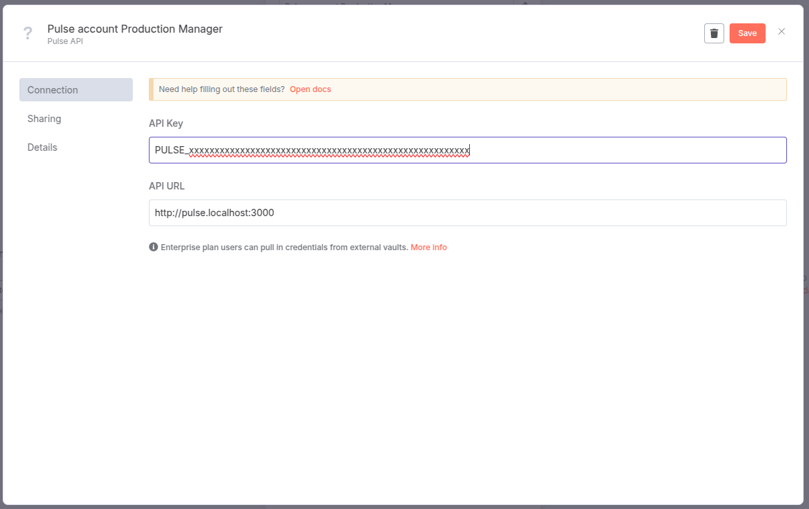

   - API Key
   - API URL (defaults to https://pulse.ingedata.ai)

#### Generate API Key from Pulse

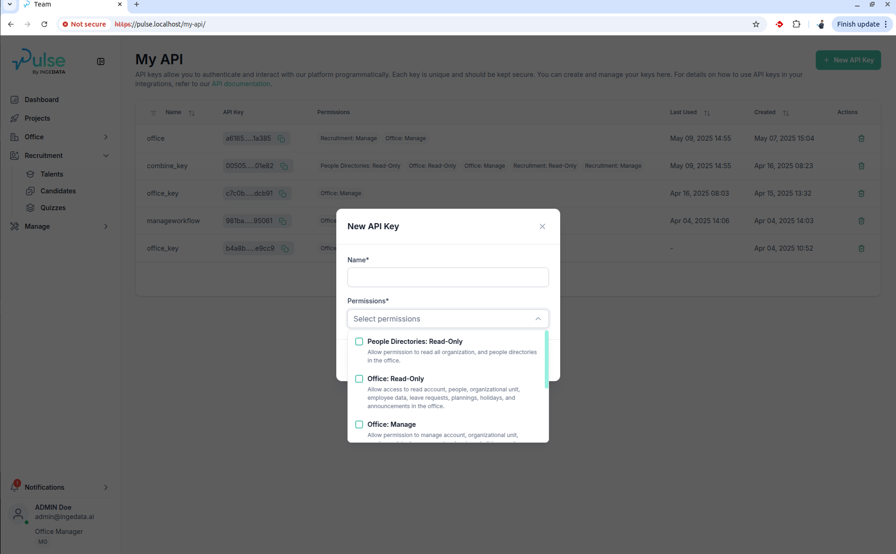

#### Generated API Key

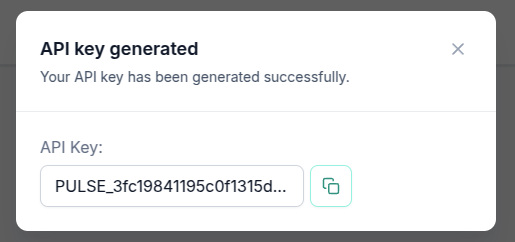

2. Use the nodes in your workflows

## Development

### Prerequisites

- Node.js (v16 or later)
- pnpm

### Getting Started

1. Clone the repository
2. Install dependencies:
   ```bash
   pnpm install
   ```
3. Build the project:
   ```bash
   pnpm build
   ```

### Development

1. Run local dev, this will watch any changes to your `./src` files
   ```bash
   pnpm dev
   ```
   Optional to watch changes with icons:
   ```bash
   pnpm dev:icons
   ```
2. Run docker compose
   ```bash
   docker compose up
   ```
3. Go to http://localhost:5678

**Note**: You will need to restart docker compose to reload the n8n node as n8n currently has an issue with linking nodes correctly to n8n.

### Testing

Run the tests:

```bash
pnpm test
```

Run tests in watch mode:

```bash
pnpm test:watch
```

## Project Structure

- `src/credentials/` - Contains credential definitions for Pulse API authentication
- `src/nodes/` - Contains all node implementations:
  - `AccountAction/` - Account management nodes
  - `OfficeAction/` - Office, employee, and planning management nodes
  - `OrganizationsAction/` - Organization and directory management nodes
  - `PeopleAction/` - People record management nodes
  - `RecruitmentAction/` - Candidate and quiz management nodes
  - `TalentAction/` - Talent profile management nodes
  - `WorkflowAction/` - Project and workflow management nodes
  - `common/` - Common base classes and utilities for nodes
- `src/utils/api/` - Contains utility classes for API interaction with Pulse platform
- `src/__tests__/` - Contains tests for all components
- `index.ts` - Main entry point that exports the credentials and nodes

## Usage Examples

### Example 1: Managing Project Activities and Work Units

This workflow demonstrates how to create work units and assign team members to activities:
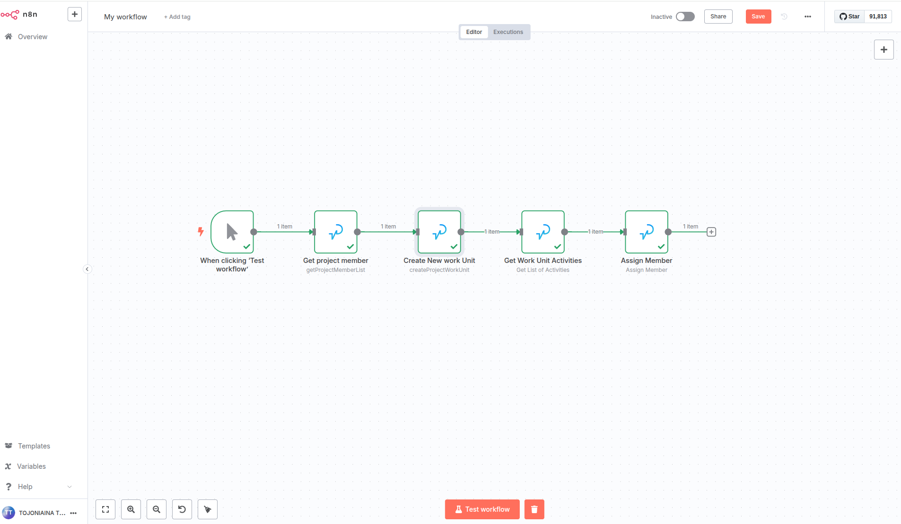

1. Set up a trigger node (e.g., "When Clicking Test Workflow")
2. Add a **WorkflowAction** node with "Project Members" resource:
   - Set Operation to "Get" to retrieve project member details
   - This provides the necessary account information for later assignment
3. Add a **WorkflowAction** node with "Project Work Units" resource:
   - Set Operation to "Create"
   - Configure a name for the work unit
   - Link to the appropriate project ID
4. Add a **WorkflowAction** node with "Activity" resource:
   - Set Operation to "Get List"
   - Use filters to retrieve activities related to the work unit
5. Add a final **WorkflowAction** node with "Activity" resource:
   - Set Operation to "Assign Member"
   - Specify the activity ID from the previous step
   - Select the account ID from the project member
   - Optionally set "Start Working" to true to immediately begin the activity

This workflow automates the process of creating work units and assigning team members to activities, streamlining project management in the Pulse platform.
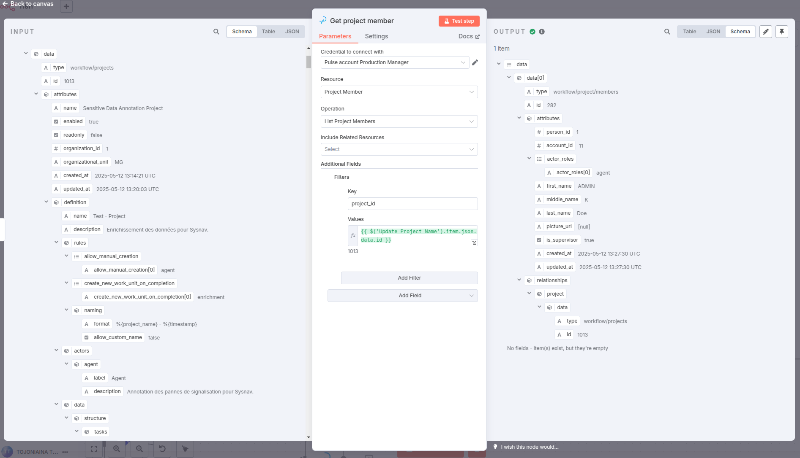
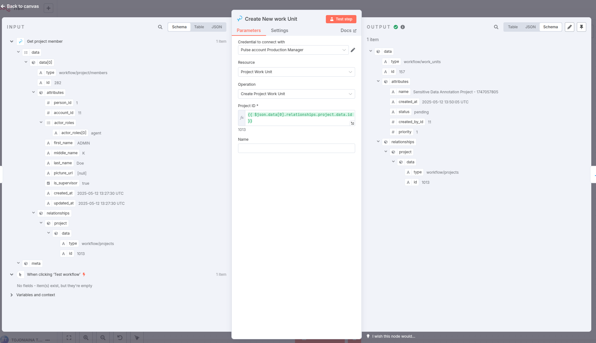
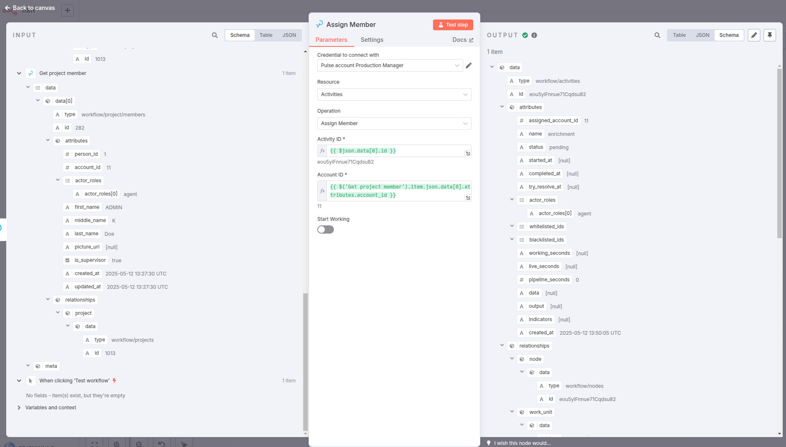

### Example 2: Project Creation and Management Workflow

This workflow demonstrates how to create and manage projects in the Pulse platform:
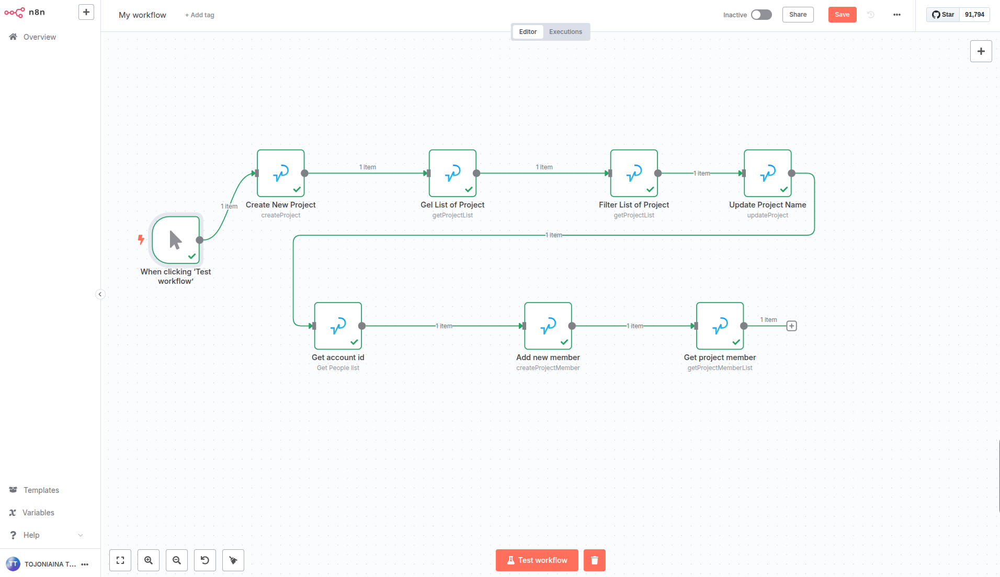

1. Set up a trigger node (e.g., "When clicking Test workflow")
2. Add a **WorkflowAction** node with "Projects" resource:
   - Set Operation to "Create"
   - Configure project name, organizational unit, and other required fields
   - This creates a new project in the Pulse platform
3. Add a **WorkflowAction** node with "Projects" resource:
   - Set Operation to "Get List"
   - Use this to retrieve the newly created project or existing projects
4. Add a **WorkflowAction** node with "Projects" resource:
   - Set Operation to "Filter List"
   - Apply filters to narrow down the project list if needed
5. Add a **WorkflowAction** node with "Projects" resource:
   - Set Operation to "Update"
   - Update project name or other project details as needed
6. Also:
   - Add a **WorkflowAction** node to get account information
   - Add a **WorkflowAction** node with "Project Members" resource to add new team members
   - Add a **WorkflowAction** node to get project Members

This workflow provides a complete project setup process, from creation to team assignment and document management.

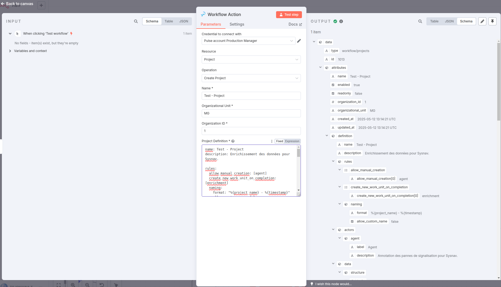
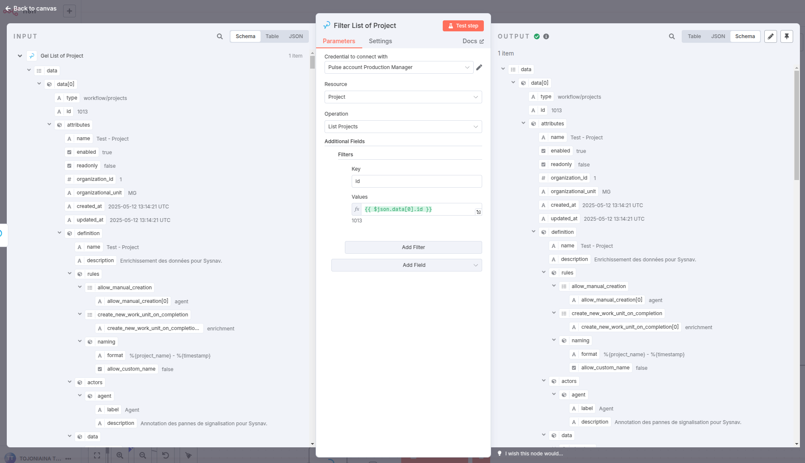
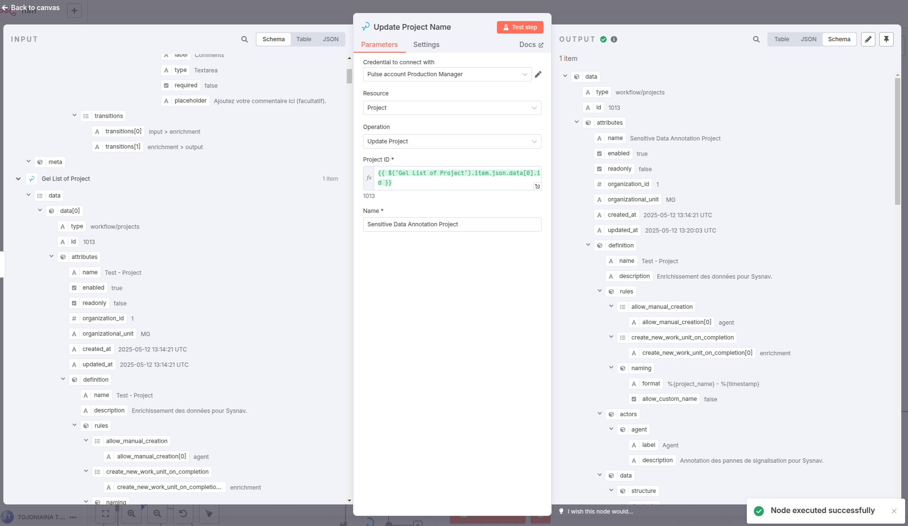
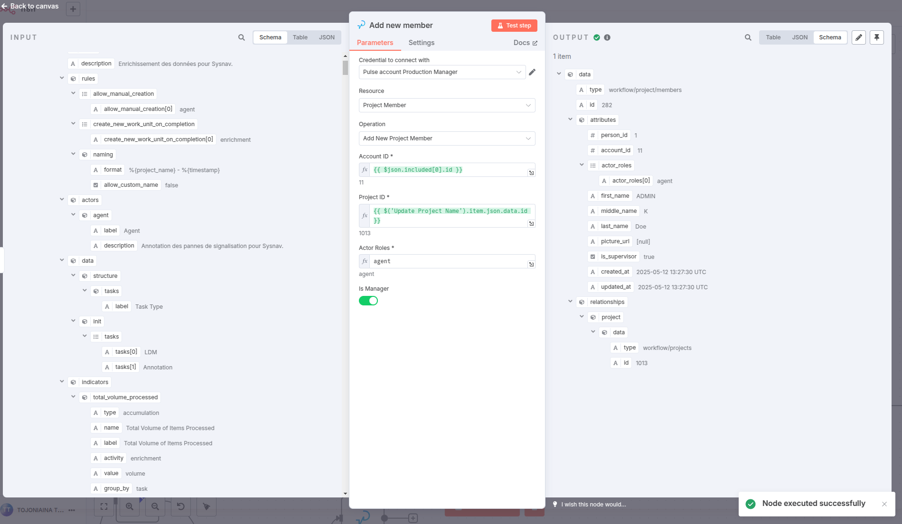

### Example 3: Managing Project Data and Documents

This workflow shows how to manage project data and documents:
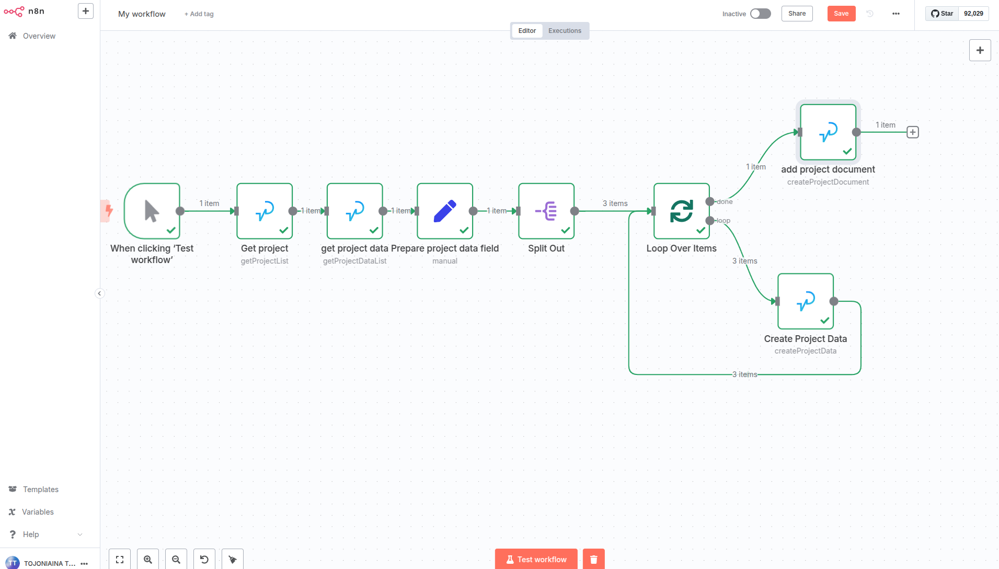

1. Set up a trigger node (e.g., "When clicking Test workflow")
2. Add a **WorkflowAction** node with "Projects" resource:
   - Set Operation to "Get" to retrieve project details
3. Add a **WorkflowAction** node with "Project Data" resource:
   - Set Operation to "Get" to retrieve existing project data
4. Add a **Function** node:
   - Use this to prepare project data fields with key-value pairs
   - Format the data according to project requirements
5. Add a **Split Out** node:
   - Split the data into individual items for processing
6. Add a **Loop Over Items** node:
   - Process each data item individually
7. Add a **WorkflowAction** node with "Project Data" resource:
   - Set Operation to "Create" to store custom project data
   - Configure key, value, and label for each data point
8. Add a **WorkflowAction** node with "Project Documents" resource:
   - Set Operation to "Create" to add project documents
   - Configure document name, category, URL, and access rights

This workflow enables efficient management of project data and documents, allowing teams to store and organize project-related information in a structured way.

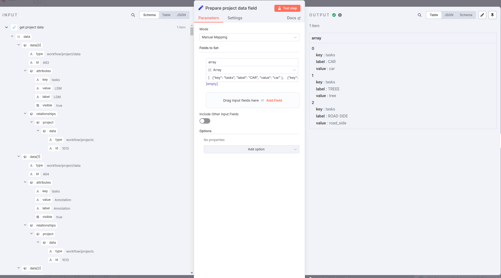

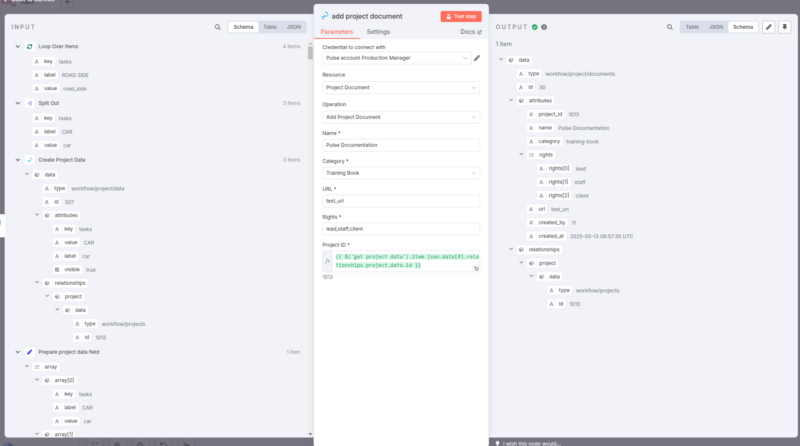

## License

ISC
